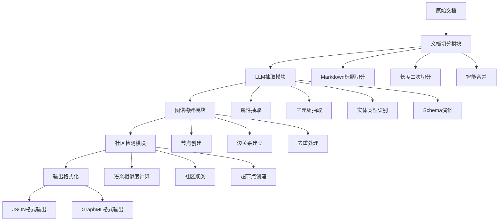
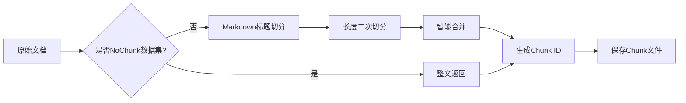
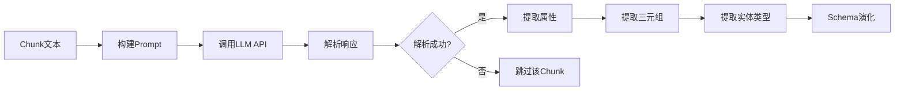
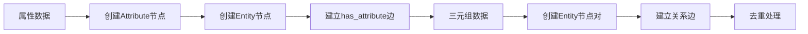
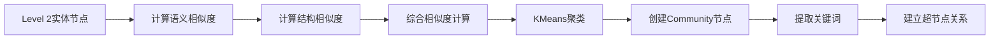
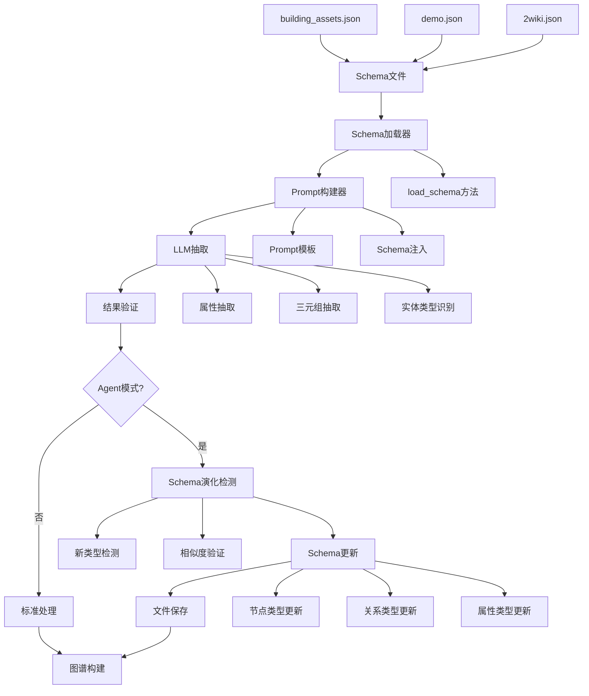

# 知识图谱构建系统详细文档

## 📋 目录

- [系统概述](#系统概述)
- [整体架构](#整体架构)
- [核心组件](#核心组件)
- [构建流程](#构建流程)
- [详细实现](#详细实现)
- [配置与模式](#配置与模式)
- [输出格式](#输出格式)
- [性能优化](#性能优化)
- [实际示例](#实际示例)
- [技术特色](#技术特色)

## 系统概述

知识图谱构建系统是一个基于大语言模型(LLM)的智能知识抽取和结构化系统，能够从非结构化文档中自动构建多层级的知识图谱。系统采用四层架构设计，支持多种数据集类型，具备智能文档切分、实体关系抽取、社区检测等核心功能。

### 核心特性

- **智能文档切分**：支持Markdown标题优先切分和长度二次切分
- **多模式处理**：支持NoAgent和Agent两种处理模式
- **四层图谱结构**：Attribute(1层) → Entity(2层) → Keyword(3层) → Community(4层)
- **动态Schema演化**：Agent模式下支持Schema自动扩展
- **社区检测算法**：基于Tree-Comm算法的智能社区发现
- **高并发处理**：支持多线程并行处理大量文档

## 整体架构



## 核心组件

### 1. KTBuilder (知识树构建器)

**文件位置**: `models/constructor/kt_gen.py`

**核心职责**:
- 文档切分和预处理
- LLM调用和响应解析
- 图谱节点和边的构建
- 多线程并发处理协调

**关键方法**:
```python
class KTBuilder:
    def __init__(self, dataset_name, schema_path=None, mode=None, config=None)
    def chunk_text(self, text, doc_index=None) -> Tuple[List[str], Dict[str, str]]
    def build_knowledge_graph(self, corpus)
    def process_all_documents(self, documents: List[Dict[str, Any]])
    def process_level1_level2(self, chunk: str, id: int)
    def process_level4(self)
```

### 2. GraphProcessor (图处理器)

**文件位置**: `utils/graph_processor.py`

**核心职责**:
- 图谱格式转换
- 节点属性标准化
- 图谱序列化和反序列化

**关键方法**:
```python
def load_graph_from_json(input_path: str) -> nx.MultiDiGraph
def save_graph_to_json(graph: nx.MultiDiGraph, output_path: str)
def load_graph_from_graphml(input_path: str) -> nx.MultiDiGraph
def save_graph_to_graphml(graph: nx.MultiDiGraph, output_path: str)
```

### 3. TreeComm (社区检测算法)

**文件位置**: `utils/tree_comm.py`

**核心职责**:
- 基于语义和结构相似度的社区检测
- 超节点创建和关键词提取
- 社区层次结构构建

**关键方法**:
```python
class FastTreeComm:
    def __init__(self, graph, embedding_model="all-MiniLM-L6-v2", struct_weight=0.3)
    def detect_communities(self, level2_nodes)
    def create_super_nodes_with_keywords(self, comm_to_nodes, level=4)
```

### 4. LLM API调用器

**文件位置**: `utils/call_llm_api.py`

**核心职责**:
- 统一的LLM API调用接口
- 响应格式化和错误处理
- Token使用量统计

## 构建流程

### 阶段1: 文档预处理与切分



**核心代码**:
```python
def chunk_text(self, text, doc_index=None) -> Tuple[List[str], Dict[str, str]]:
    """将文档切分为多个块"""
    # 1) no_chunk 数据集：整文返回
    if self.dataset_name in self.datasets_no_chunk:
        base = f"{text.get('title', '')} {text.get('text', '')}".strip()
        chunks = [base]
    else:
        # 2) 标题优先切分
        full_text = f"{text.get('title', '')}\n\n{text.get('text', '')}"
        # 依据标题级别粗切
        level4 = split_by_header(full_text, "#### ")
        if level4 and len(level4) > 1:
            segments = level4
        else:
            level3 = split_by_header(full_text, "### ")
            if level3 and len(level3) > 1:
                segments = level3
            else:
                level2 = split_by_header(full_text, "## ")
                segments = level2 if (level2 and len(level2) > 1) else [full_text]
        
        # 3) 长度二次切分
        max_len = getattr(self.config.construction, 'chunk_size', 400) or 400
        overlap = getattr(self.config.construction, 'overlap', 100) or 100
        chunks = []
        for seg in segments:
            chunks.extend(split_by_length(seg, max_len, overlap))
    
    # 4) 智能合并：如果切片过多，按相似度和长度合并
    if len(chunks) > 30:
        chunks = self.smart_merge_chunks(chunks, target_count=25)
    
    return chunks, chunk2id
```

### 阶段2: LLM知识抽取



**核心代码**:
```python
def process_level1_level2(self, chunk: str, id: int):
    """处理属性(level 1)和三元组(level 2)"""
    prompt = self._get_construction_prompt(chunk)
    llm_response = self.extract_with_llm(prompt)
    
    # 验证和解析响应
    parsed_response = self._validate_and_parse_llm_response(prompt, llm_response)
    if not parsed_response:
        return
    
    extracted_attr = parsed_response.get("attributes", {})
    extracted_triples = parsed_response.get("triples", [])
    entity_types = parsed_response.get("entity_types", {})
    
    # 处理属性和三元组
    attr_nodes, attr_edges = self._process_attributes(extracted_attr, id, entity_types)
    triple_nodes, triple_edges = self._process_triples(extracted_triples, id, entity_types)
    
    # 添加到图中
    with self.lock:
        for node_id, node_data in attr_nodes + triple_nodes:
            self.graph.add_node(node_id, **node_data)
        for u, v, relation in attr_edges + triple_edges:
            self.graph.add_edge(u, v, relation=relation)
```

### 阶段3: 图谱构建



**核心代码**:
```python
def _process_attributes(self, extracted_attr: dict, chunk_id: int, entity_types: dict = None):
    """处理提取的属性"""
    nodes_to_add = []
    edges_to_add = []
    
    for entity, attributes in extracted_attr.items():
        for attr in attributes:
            # 创建属性节点
            attr_node_id = f"attr_{self.node_counter}"
            nodes_to_add.append((
                attr_node_id,
                {
                    "label": "attribute",
                    "properties": {"name": attr, "chunk id": chunk_id},
                    "level": 1,
                }
            ))
            self.node_counter += 1

            # 创建或找到实体节点
            entity_type = entity_types.get(entity) if entity_types else None
            entity_node_id = self._find_or_create_entity(entity, chunk_id, nodes_to_add, entity_type)
            edges_to_add.append((entity_node_id, attr_node_id, "has_attribute"))
    
    return nodes_to_add, edges_to_add

def _process_triples(self, extracted_triples: list, chunk_id: int, entity_types: dict = None):
    """处理提取的三元组"""
    nodes_to_add = []
    edges_to_add = []
    
    for triple in extracted_triples:
        validated_triple = self._validate_triple_format(triple)
        if not validated_triple:
            continue
            
        subj, pred, obj = validated_triple
        
        subj_type = entity_types.get(subj) if entity_types else None
        obj_type = entity_types.get(obj) if entity_types else None
        
        subj_node_id = self._find_or_create_entity(subj, chunk_id, nodes_to_add, subj_type)
        obj_node_id = self._find_or_create_entity(obj, chunk_id, nodes_to_add, obj_type)
        
        edges_to_add.append((subj_node_id, obj_node_id, pred))
    
    return nodes_to_add, edges_to_add
```

### 阶段4: 社区检测与超节点创建



**核心代码**:
```python
def process_level4(self):
    """使用Tree-Comm算法处理社区"""
    level2_nodes = [n for n, d in self.graph.nodes(data=True) if d['level'] == 2]
    start_comm = time.time()
    
    _tree_comm = tree_comm.FastTreeComm(
        self.graph, 
        embedding_model=self.config.tree_comm.embedding_model,
        struct_weight=self.config.tree_comm.struct_weight,
    )
    comm_to_nodes = _tree_comm.detect_communities(level2_nodes)

    # 创建超节点 (level 4 communities)
    _tree_comm.create_super_nodes_with_keywords(comm_to_nodes, level=4)
    
    end_comm = time.time()
    logger.info(f"Community Indexing Time: {end_comm - start_comm}s")
```

## 详细实现

### 1. 文档切分策略

#### Markdown标题优先切分
```python
def split_by_header(s: str, header: str) -> List[str]:
    """根据标题级别切分文档"""
    pattern = re.compile(rf"^\s*{re.escape(header)}")
    parts: List[str] = []
    buf: List[str] = []
    for line in s.splitlines():
        if pattern.match(line):
            if buf:  # 如果buf不为空，先保存当前段落
                parts.append("\n".join(buf).strip())
            buf = [line]  # 开始新段落
        else:
            buf.append(line)
    if buf:
        parts.append("\n".join(buf).strip())
    return [p for p in parts if p]
```

#### 长度二次切分
```python
def split_by_length(s: str, size: int, ov: int) -> List[str]:
    """按长度切分文本，支持重叠"""
    if len(s) <= size:
        return [s]
    res: List[str] = []
    start = 0
    while start < len(s):
        end = min(start + size, len(s))
        res.append(s[start:end])
        if end == len(s):
            break
        start = max(0, end - ov)
    return res
```

#### 智能合并策略
```python
def smart_merge_chunks(self, chunks: List[str], target_count: int = 25) -> List[str]:
    """智能合并切片，基于相似度和长度"""
    if len(chunks) <= target_count:
        return chunks
    
    # 1) 按内容相似度分组（基于关键词）
    def extract_keywords(text: str) -> set:
        words = re.findall(r'[\u4e00-\u9fff]+|[A-Za-z]+|[A-Z0-9-]+', text)
        return set(word.lower() for word in words if len(word) > 1)
    
    # 2) 按长度合并
    merged_chunks = []
    remaining_chunks = chunks.copy()
    
    while remaining_chunks:
        group = []
        total_length = 0
        target_length = 1500  # 目标合并长度
        
        while remaining_chunks and total_length < target_length:
            chunk = remaining_chunks.pop(0)
            group.append(chunk)
            total_length += len(chunk)
        
        if len(group) == 1:
            merged_chunks.append(group[0])
        else:
            merged_text = "\n\n".join(group)
            merged_chunks.append(merged_text)
    
    return merged_chunks
```

### 2. LLM Prompt工程

#### 基础Prompt模板
```python
def _get_construction_prompt(self, chunk: str) -> str:
    """根据数据集名称和模式获取构建提示词"""
    recommend_schema = json.dumps(self.schema, ensure_ascii=False)
    
    # 基础prompt类型映射
    prompt_type_map = {
        "novel": "novel",
        "novel_eng": "novel_eng"
    }
    
    base_prompt_type = prompt_type_map.get(self.dataset_name, "general")
    
    # 添加agent后缀如果处于agent模式
    if self.mode == "agent":
        prompt_type = f"{base_prompt_type}_agent"
    else:
        prompt_type = base_prompt_type
    
    return self.config.get_prompt_formatted("construction", prompt_type, schema=recommend_schema, chunk=chunk)
```

#### 建筑资产专用增强Prompt
```python
def _get_enhanced_prompt(self, base_prompt: str) -> str:
    """根据数据集类型生成增强的prompt"""
    if self.dataset_name == "building_assets":
        return f"""{base_prompt}

CRITICAL FORMAT REQUIREMENTS FOR BUILDING ASSETS:
- Return ONLY valid JSON format
- Must include exactly these fields: "attributes", "triples", "entity_types"
- Use ENGLISH relation names from the provided schema
- Use specific entity names (not generic types) as keys in attributes
- Do not include any explanations or markdown formatting
- Start directly with {{ and end with }}

RELATION MAPPING (Use English names):
- "属于" → "belongs_to_system"
- "位于/安装位置" → "located_in" 
- "生产/制造" → "manufactured_by"
- "型号" → "has_model"
- "安装在" → "installed_in"
- "服务" → "serves"
- "连接" → "connects_to"
- "控制" → "controls"
- "供应" → "supplies"
- "包含" → "contains"
- "部分" → "part_of"

CRITICAL: Extract hierarchical location relationships!
- If equipment is in "LOC-A-03-AHU", create: ["LOC-A-03-AHU", "part_of", "A栋三层"]
- If space has "floor: 3F", create: ["space_name", "located_in", "A栋三层"]  
- If equipment has location_id, create both: equipment→located_in→location AND location→part_of→floor
- Always extract floor-level relationships from location codes (LOC-A-03-* means A栋三层)
"""
```

### 3. 实体节点管理

#### 实体查找与创建
```python
def _find_or_create_entity(self, entity_name: str, chunk_id: int, nodes_to_add: list, entity_type: str = None) -> str:
    """查找现有实体或创建新实体，返回实体节点ID"""
    with self.lock:
        entity_node_id = next(
            (
                n
                for n, d in self.graph.nodes(data=True)
                if d.get("label") == "entity" and d["properties"]["name"] == entity_name
            ),
            None,
        )
        
        if not entity_node_id:
            entity_node_id = f"entity_{self.node_counter}"
            properties = {"name": entity_name, "chunk id": chunk_id}
            if entity_type:
                properties["schema_type"] = entity_type
            
            nodes_to_add.append((
                entity_node_id,
                {
                    "label": "entity", 
                    "properties": properties, 
                    "level": 2
                }
            ))
            self.node_counter += 1
            
    return entity_node_id
```

#### 三元组格式验证
```python
def _validate_triple_format(self, triple: list) -> tuple:
    """验证和标准化三元组格式"""
    try:
        if len(triple) > 3:
            triple = triple[:3]
        elif len(triple) < 3:
            return None
        
        return tuple(triple)
    except Exception as e:
        return None
```

### 4. 关系标准化

#### 中英文关系映射
```python
def _get_relation_mapping(self) -> dict:
    """获取中英文关系词映射表"""
    return {
        # 中文到英文的关系映射
        "属于": "belongs_to_system",
        "位于": "located_in",
        "安装位置": "located_in",
        "安装在": "located_in",
        "生产": "manufactured_by",
        "制造": "manufactured_by",
        "生产公司": "manufactured_by",
        "制造商": "manufactured_by",
        "型号": "has_model",
        "模型": "has_model",
        "服务": "serves",
        "连接": "connects_to",
        "控制": "controls",
        "供应": "supplies",
        "包含": "contains",
        "部分": "part_of",
        "组成": "part_of",
    }

def _normalize_relations(self, triples: list) -> list:
    """标准化关系词，将中文关系映射为英文schema关系"""
    if not triples:
        return triples
        
    relation_mapping = self._get_relation_mapping()
    normalized_triples = []
    
    for triple in triples:
        if len(triple) >= 3:
            subj, pred, obj = triple[0], triple[1], triple[2]
            # 映射中文关系词到英文
            normalized_pred = relation_mapping.get(pred, pred)
            normalized_triples.append([subj, normalized_pred, obj])
        else:
            normalized_triples.append(triple)
            
    return normalized_triples
```

### 5. 层级关系补充

#### 建筑资产层级关系推导
```python
def _add_hierarchical_relations(self, parsed_result: dict) -> dict:
    """为建筑资产数据补充层级关系"""
    if not parsed_result or "triples" not in parsed_result:
        return parsed_result
        
    additional_triples = []
    existing_triples = set()
    
    # 记录现有三元组，避免重复
    for triple in parsed_result["triples"]:
        if len(triple) >= 3:
            existing_triples.add((triple[0], triple[1], triple[2]))
    
    # 从位置编码推导层级关系 (LOC-A-03-* → A栋三层)
    for triple in parsed_result["triples"]:
        if len(triple) >= 3 and triple[1] == "located_in":
            location = triple[2]
            if isinstance(location, str) and location.startswith("LOC-"):
                floor_name = self._extract_floor_from_location(location)
                if floor_name:
                    # location → part_of → floor
                    triple_new = (location, "part_of", floor_name)
                    if triple_new not in existing_triples:
                        additional_triples.append([triple_new[0], triple_new[1], triple_new[2]])
                        existing_triples.add(triple_new)
    
    # 添加新的三元组
    if additional_triples:
        parsed_result["triples"].extend(additional_triples)
        logger.info(f"Added {len(additional_triples)} hierarchical relations")
    
    return parsed_result
```

### 6. 社区检测算法

#### Tree-Comm算法实现
```python
class FastTreeComm:
    def __init__(self, graph, embedding_model="all-MiniLM-L6-v2", struct_weight=0.3, config=None):
        self.graph = graph
        self.model = SentenceTransformer(embedding_model)
        self.semantic_cache = {}
        self.struct_weight = struct_weight
    
    def detect_communities(self, level2_nodes):
        """检测社区"""
        # 1. 计算语义相似度
        semantic_similarities = self._calculate_semantic_similarities(level2_nodes)
        
        # 2. 计算结构相似度
        structural_similarities = self._calculate_structural_similarities(level2_nodes)
        
        # 3. 综合相似度
        combined_similarities = self._combine_similarities(semantic_similarities, structural_similarities)
        
        # 4. KMeans聚类
        communities = self._perform_clustering(level2_nodes, combined_similarities)
        
        return communities
    
    def create_super_nodes_with_keywords(self, comm_to_nodes, level=4):
        """创建带关键词的超节点"""
        for comm_id, nodes in comm_to_nodes.items():
            # 创建社区节点
            comm_node_id = f"community_{comm_id}"
            comm_name = self._generate_community_name(nodes)
            
            self.graph.add_node(
                comm_node_id,
                label="community",
                properties={"name": comm_name},
                level=level
            )
            
            # 提取关键词
            keywords = self._extract_keywords_from_nodes(nodes)
            
            # 创建关键词节点并连接到社区
            for keyword in keywords:
                kw_node_id = f"keyword_{len(self.graph.nodes)}"
                self.graph.add_node(
                    kw_node_id,
                    label="keyword",
                    properties={"name": keyword},
                    level=3
                )
                self.graph.add_edge(kw_node_id, comm_node_id, relation="describes")
            
            # 连接实体到社区
            for node_id in nodes:
                self.graph.add_edge(node_id, comm_node_id, relation="belongs_to")
```

## Schema系统

### 1. Schema定义与作用

Schema是知识图谱构建系统的核心指导文件，定义了知识抽取的规范框架，包括：

- **Nodes（节点类型）**: 定义可抽取的实体类型
- **Relations（关系类型）**: 定义实体间可建立的关系类型  
- **Attributes（属性类型）**: 定义实体的属性类型

Schema在整个构建流程中发挥关键作用：
1. **指导LLM抽取**: 为LLM提供结构化的抽取目标
2. **约束输出格式**: 确保抽取结果符合预定义规范
3. **支持Schema演化**: Agent模式下可动态扩展Schema
4. **保证数据质量**: 通过预定义类型提高抽取准确性

### 2. Schema系统架构



### 3. Schema文件结构

#### 建筑资产Schema示例
```json
{
  "Nodes": [
    "asset", "system", "location", "building", "floor", 
    "room", "manufacturer", "model", "equipment_type"
  ],
  "Relations": [
    "located_in", "part_of", "belongs_to_system", "manufactured_by",
    "has_model", "installed_in", "serves", "connects_to", 
    "controls", "supplies", "contains"
  ],
  "Attributes": [
    "asset_id", "asset_name", "asset_type", "system_id",
    "location_id", "model", "manufacturer", "install_date",
    "area_sqm", "building", "floor", "description", "category"
  ]
}
```

#### 通用领域Schema示例
```json
{
  "Nodes": [
    "person", "location", "organization", "event", "object",
    "concept", "time_period", "creative_work", "biological_entity"
  ],
  "Relations": [
    "is_a", "part_of", "located_in", "created_by", "used_by",
    "participates_in", "related_to", "belongs_to", "influences"
  ],
  "Attributes": [
    "name", "date", "size", "type", "description", "status",
    "quantity", "value", "position", "duration", "time"
  ]
}
```

### 3. Schema加载机制

```python
def load_schema(self, schema_path) -> Dict[str, Any]:
    """加载Schema文件"""
    try:
        with open(schema_path) as f:
            schema = json.load(f)
            return schema
    except FileNotFoundError:
        return dict()

# 在KTBuilder初始化时加载Schema
def __init__(self, dataset_name, schema_path=None, mode=None, config=None):
    self.schema = self.load_schema(schema_path or config.get_dataset_config(dataset_name).schema_path)
```

### 4. Schema在Prompt中的应用

#### 基础Prompt模板
```python
def _get_construction_prompt(self, chunk: str) -> str:
    """根据数据集名称和模式获取构建提示词"""
    recommend_schema = json.dumps(self.schema, ensure_ascii=False)
    
    return self.config.get_prompt_formatted(
        "construction", 
        prompt_type, 
        schema=recommend_schema, 
        chunk=chunk
    )
```

#### Prompt中的Schema指导
```
Guidelines:
1. Prioritize the following predefined schema for extraction;
   ```{schema}```
2. Flexibility: If the context doesn't fit the predefined schema, 
   extract the valuable knowledge as needed;
3. Conciseness: The Attributes and Triples you extract should be 
   complementary and no semantic redundancy.
4. Do NOT miss any useful information in the context;
5. Output Format: Return only JSON with:
   - Attributes: Map each entity to its descriptive features
   - Triples: List relations between entities in [entity1, relation, entity2] format
   - Entity_types: Map each entity to its schema type based on the provided schema
```

### 5. Schema演化机制（Agent模式）

#### 动态Schema更新
```python
def _update_schema_with_new_types(self, new_schema_types: Dict[str, List[str]]):
    """更新Schema文件，添加LLM发现的新类型"""
    try:
        schema_paths = {
            "hotpot": "schemas/hotpot.json",
            "2wiki": "schemas/2wiki.json", 
            "musique": "schemas/musique.json",
            "novel": "schemas/novels_chs.json",
            "graphrag-bench": "schemas/graphrag-bench.json"
        }
        
        schema_path = schema_paths.get(self.dataset_name)
        if not schema_path:
            return
            
        with open(schema_path, 'r', encoding='utf-8') as f:
            current_schema = json.load(f)
        
        updated = False
        
        # 添加新节点类型
        if "nodes" in new_schema_types:
            for new_node in new_schema_types["nodes"]:
                if new_node not in current_schema.get("Nodes", []):
                    current_schema.setdefault("Nodes", []).append(new_node)
                    updated = True
        
        # 添加新关系类型
        if "relations" in new_schema_types:
            for new_relation in new_schema_types["relations"]:
                if new_relation not in current_schema.get("Relations", []):
                    current_schema.setdefault("Relations", []).append(new_relation)
                    updated = True

        # 添加新属性类型
        if "attributes" in new_schema_types:
            for new_attribute in new_schema_types["attributes"]:
                if new_attribute not in current_schema.get("Attributes", []):
                    current_schema.setdefault("Attributes", []).append(new_attribute)
                    updated = True
        
        # 保存更新后的Schema
        if updated:
            with open(schema_path, 'w', encoding='utf-8') as f:
                json.dump(current_schema, f, ensure_ascii=False, indent=2)
            
            # 更新内存中的Schema
            self.schema = current_schema
            
    except Exception as e:
        logger.error(f"Failed to update schema for dataset '{self.dataset_name}': {e}")
```

#### Agent模式Prompt中的Schema演化指导
```
Schema Evolution: If you find new and important entity types, relation types, 
or attribute types that are valuable for knowledge extraction, include them 
in a "new_schema_types" field. Notably, the strict threshold of adding 
new schema considering both importance and similarity to the pattern in the 
existing schema is 0.9.

Example Output:
{
  "attributes": {...},
  "triples": [...],
  "entity_types": {...},
  "new_schema_types": {
    "nodes": ["Instrument"],
    "relations": ["owns"],
    "attributes": ["skill_level"]
  }
}
```

### 6. Schema演化实际示例

#### 初始Schema（建筑资产）
```json
{
  "Nodes": ["asset", "location", "building", "floor"],
  "Relations": ["located_in", "part_of", "belongs_to_system"],
  "Attributes": ["asset_id", "location_id", "building", "floor"]
}
```

#### LLM发现新类型
```json
{
  "attributes": {
    "A栋3层空调箱": ["asset_id: A-AHU-03", "model: KML-20", "install_date: 2022-05-01"],
    "开利公司": ["company_type: 制造商", "founded_year: 1902"]
  },
  "triples": [
    ["A栋3层空调箱", "manufactured_by", "开利公司"],
    ["A栋3层空调箱", "has_model", "KML-20"]
  ],
  "entity_types": {
    "A栋3层空调箱": "asset",
    "开利公司": "manufacturer",
    "KML-20": "model"
  },
  "new_schema_types": {
    "nodes": ["manufacturer", "model"],
    "relations": ["manufactured_by", "has_model"],
    "attributes": ["model", "install_date", "company_type", "founded_year"]
  }
}
```

#### 更新后的Schema
```json
{
  "Nodes": [
    "asset", "location", "building", "floor", 
    "manufacturer", "model"
  ],
  "Relations": [
    "located_in", "part_of", "belongs_to_system",
    "manufactured_by", "has_model"
  ],
  "Attributes": [
    "asset_id", "location_id", "building", "floor",
    "model", "install_date", "company_type", "founded_year"
  ]
}
```

### 7. 关系标准化与Schema映射

#### 中英文关系映射
```python
def _get_relation_mapping(self) -> dict:
    """获取中英文关系词映射表，确保与Schema一致"""
    return {
        # 中文到英文的关系映射
        "属于": "belongs_to_system",
        "位于": "located_in",
        "安装位置": "located_in",
        "安装在": "located_in",
        "生产": "manufactured_by",
        "制造": "manufactured_by",
        "型号": "has_model",
        "模型": "has_model",
        "服务": "serves",
        "连接": "connects_to",
        "控制": "controls",
        "供应": "supplies",
        "包含": "contains",
        "部分": "part_of",
        "组成": "part_of",
    }
```

#### 实体类型验证
```python
def _find_or_create_entity(self, entity_name: str, chunk_id: int, nodes_to_add: list, entity_type: str = None) -> str:
    """创建实体节点时验证实体类型是否在Schema中"""
    # 验证实体类型是否在Schema中定义
    if entity_type and self.schema.get("Nodes") and entity_type not in self.schema["Nodes"]:
        logger.warning(f"Entity type '{entity_type}' not in schema, using default")
        entity_type = None
    
    properties = {"name": entity_name, "chunk id": chunk_id}
    if entity_type:
        properties["schema_type"] = entity_type
```

## 配置与模式

### 1. 处理模式

#### NoAgent模式
- 标准的知识抽取流程
- 基于预定义Schema进行抽取
- 不支持Schema动态演化
- 适用于稳定的知识领域

#### Agent模式
- 支持Schema动态演化
- LLM可以建议新的实体类型、关系类型和属性类型
- 自动更新Schema文件
- 适用于探索性知识抽取

### 2. 数据集配置

#### 建筑资产数据集配置
```yaml
building_assets:
  corpus_path: data/uploaded/building_assets/corpus.json
  qa_path: data/uploaded/building_assets/qa_pairs.json
  schema_path: schemas/building_assets.json
  graph_output: output/graphs/building_assets_new.json
```

#### Schema定义
```json
{
  "Nodes": [
    "asset", "system", "location", "building", "floor", 
    "room", "manufacturer", "model", "equipment_type"
  ],
  "Relations": [
    "located_in", "part_of", "belongs_to_system", "manufactured_by",
    "has_model", "installed_in", "serves", "connects_to", 
    "controls", "supplies", "contains"
  ],
  "Attributes": [
    "asset_id", "asset_name", "asset_type", "system_id",
    "location_id", "model", "manufacturer", "install_date",
    "area_sqm", "building", "floor", "description", "category"
  ]
}
```

### 3. 性能配置

```yaml
performance:
  batch_size: 16
  max_workers: 32
  memory_optimization: true
  parallel_processing: true

construction:
  chunk_size: 400
  overlap: 100
  max_workers: 32
  mode: "noagent"  # 或 "agent"

tree_comm:
  embedding_model: "all-MiniLM-L6-v2"
  struct_weight: 0.3
```

## 输出格式

### 1. JSON格式输出

```json
[
  {
    "start_node": {
      "label": "entity",
      "properties": {
        "name": "A栋3层空调箱",
        "chunk id": "abc123",
        "schema_type": "asset"
      }
    },
    "relation": "located_in",
    "end_node": {
      "label": "entity",
      "properties": {
        "name": "LOC-A-03-AHU",
        "chunk id": "def456",
        "schema_type": "location"
      }
    }
  }
]
```

### 2. 图谱层级结构

- **Level 1 (Attribute)**: 属性节点，包含具体的属性值
- **Level 2 (Entity)**: 实体节点，包含实体名称和类型信息
- **Level 3 (Keyword)**: 关键词节点，从社区中提取的关键词
- **Level 4 (Community)**: 社区节点，通过聚类算法生成的超节点

### 3. 节点属性标准化

```python
def _normalize_props(p: dict) -> dict:
    """标准化节点属性"""
    if not isinstance(p, dict):
        return {"name": str(p)}
    props_norm = dict(p)
    # 标准化chunk id键
    for k in ["chunk_id", "chunkId", "source_chunk", "source_chunk_id", "chunk"]:
        if k in props_norm and "chunk id" not in props_norm:
            props_norm["chunk id"] = props_norm[k]
            break
    return props_norm
```

## 性能优化

### 1. 并发处理

```python
def process_all_documents(self, documents: List[Dict[str, Any]]) -> None:
    """多线程并发处理所有文档"""
    max_workers = min(self.config.construction.max_workers, (os.cpu_count() or 1) + 4)
    
    with futures.ThreadPoolExecutor(max_workers=max_workers) as executor:
        # 提交所有文档处理任务
        all_futures = [executor.submit(self.process_document, doc, doc_index=i) 
                      for i, doc in enumerate(documents)]
        
        # 处理完成的任务
        for future in futures.as_completed(all_futures, timeout=300):
            try:
                future.result(timeout=180)
                processed_count += 1
            except Exception as e:
                logger.error(f"Document processing failed: {e}")
                failed_count += 1
```

### 2. 内存优化

- **分块处理**: 避免一次性加载所有文档到内存
- **缓存机制**: 语义相似度计算结果缓存
- **及时清理**: 处理完成后及时释放中间结果

### 3. 智能合并

- **相似度计算**: 基于关键词相似度进行chunk合并
- **长度控制**: 控制合并后的chunk长度在合理范围内
- **数量限制**: 限制最终chunk数量在30个以内

## 实际示例

### 1. 建筑资产图谱构建示例

**输入文档**:
```markdown
#### 设备: A栋3层空调箱 (A-AHU-03)
- 型号: KML-20
- 安装日期: 2022-05-01
- 位置: LOC-A-03-AHU
- 系统: HVAC系统
- 制造商: 开利公司
```

**LLM抽取结果**:
```json
{
  "attributes": {
    "A栋3层空调箱": ["asset_id: A-AHU-03", "model: KML-20", "install_date: 2022-05-01"],
    "LOC-A-03-AHU": ["location_id: LOC-A-03-AHU", "asset_type: 机房"],
    "A栋三层": ["floor: 3F", "building: A栋"]
  },
  "triples": [
    ["A栋3层空调箱", "located_in", "LOC-A-03-AHU"],
    ["A栋3层空调箱", "belongs_to_system", "HVAC系统"],
    ["A栋3层空调箱", "manufactured_by", "开利公司"],
    ["LOC-A-03-AHU", "part_of", "A栋三层"]
  ],
  "entity_types": {
    "A栋3层空调箱": "asset",
    "LOC-A-03-AHU": "location",
    "A栋三层": "floor",
    "HVAC系统": "system",
    "开利公司": "manufacturer"
  }
}
```

**生成的图谱结构**:
```
Entity: A栋3层空调箱 (asset)
├── Attribute: asset_id: A-AHU-03
├── Attribute: model: KML-20
├── Attribute: install_date: 2022-05-01
├── Relation: located_in → LOC-A-03-AHU
├── Relation: belongs_to_system → HVAC系统
└── Relation: manufactured_by → 开利公司

Entity: LOC-A-03-AHU (location)
├── Attribute: location_id: LOC-A-03-AHU
├── Attribute: asset_type: 机房
└── Relation: part_of → A栋三层

Entity: A栋三层 (floor)
├── Attribute: floor: 3F
└── Attribute: building: A栋
```

### 2. 社区检测示例

**输入**: Level 2实体节点列表
**处理**: Tree-Comm算法聚类
**输出**: 社区超节点

```
Community: HVAC设备群
├── Keyword: 空调
├── Keyword: 制冷
├── Keyword: 通风
├── Entity: A栋3层空调箱
├── Entity: B栋5层空调箱
└── Entity: 冷冻水循环泵-01

Community: 电气设备群
├── Keyword: 配电
├── Keyword: 电力
├── Entity: A栋配电箱-01
├── Entity: B栋配电柜-02
└── Entity: 主配电室
```

## 技术特色

### 1. 智能文档切分
- **多级标题识别**: 支持####、###、##多级标题切分
- **长度自适应**: 根据内容长度动态调整切分策略
- **智能合并**: 基于相似度的chunk合并算法

### 2. 多模式处理
- **NoAgent模式**: 稳定的基于Schema的抽取
- **Agent模式**: 支持Schema动态演化的智能抽取

### 3. 智能Schema系统
- **预定义Schema**: 为不同领域提供标准化的抽取框架
- **动态Schema演化**: Agent模式下自动发现和添加新类型
- **关系标准化**: 中英文关系映射确保一致性
- **类型验证**: 自动验证实体类型是否符合Schema定义

### 4. 层级图谱结构
- **四层架构**: Attribute → Entity → Keyword → Community
- **关系丰富**: 支持多种实体间关系类型
- **属性完整**: 每个节点包含完整的属性信息

### 5. 社区检测算法
- **语义+结构**: 结合语义相似度和结构相似度
- **层次聚类**: 生成多层次的社区结构
- **关键词提取**: 自动提取社区代表性关键词

### 6. 高性能处理
- **并发处理**: 多线程并行处理大量文档
- **内存优化**: 分块处理避免内存溢出
- **缓存机制**: 智能缓存减少重复计算

### 7. 灵活配置
- **多数据集支持**: 支持不同类型的数据集
- **可配置参数**: 丰富的配置选项
- **扩展性强**: 易于添加新的处理模式

## 总结

知识图谱构建系统是一个功能完整、性能优异的智能知识抽取系统。通过智能文档切分、LLM知识抽取、多层级图谱构建和社区检测等核心技术，能够从非结构化文档中自动构建高质量的知识图谱。系统支持多种处理模式和数据集类型，具备良好的扩展性和可配置性，为后续的知识检索和问答系统提供了坚实的数据基础。

---

*本文档基于实际代码实现编写，详细描述了知识图谱构建系统的完整架构、核心组件、构建流程和技术特色。*
